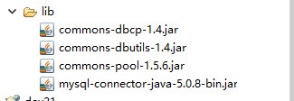
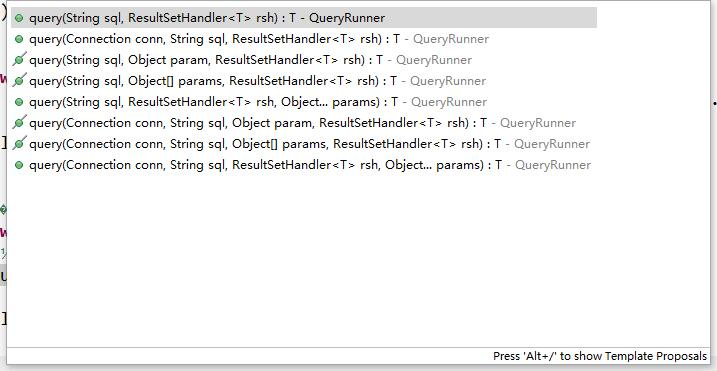

# 使用
## 一,导包

## 二、数据库连接池原理

## 三、编写标准的数据库连接池

    实现了javax.sql.DataSource的才是标准的数据库连接池，按照字面意思，一般称之为数据源。
    
    对于一个已知类的某个方法进行功能上的改变有以下三种方式：
    1、定义子类，扩展父类的某个功能。（此处行不通）
    2、利用包装设计模式改写原有的类的功能
        a、编写一个类实现与被改写类（com.mysql.jdbc.Connection）相同的接口
        b、定义一个引用，记住被改写类的实例
        c、定义构造方法，传入被改写类的实例
        d、对于要改写的方法，改写即可
        e、对于不需要改写的方法，调用原有的对象的对应方法
        
        *****包装设计模式
        *****默认适配器设计模式
        
    3、动态代理
        *****基于接口的动态代理
    java.lang.reflect.Proxy
    static Object newProxyInstance(ClassLoader loader, Class<?>[] interfaces, InvocationHandler h) 
 
    作用：返回代理类的实例
    参数：loader：类加载器，一般与被代理对象使用同一个
         interfaces：被代理对象所实现的接口
         h：怎么代理
             Object invoke(Object proxy, Method method, Object[] args) ：调用原有类的任何方法，都会经过此方法。
             
## 四、开源的数据源使用   ---DBCP
```java
        DBCP：DataBase Connection Pool
            1、需要的jar：commons-dbcp.jar  commons-pool.jar
            2、把DBCP的配置文件拷贝到构建路径中
            3、
            package cn.itcast.util;

            import java.io.InputStream;
            import java.sql.Connection;
            import java.sql.ResultSet;
            import java.sql.SQLException;
            import java.sql.Statement;
            import java.util.Properties;

            import javax.sql.DataSource;

            import org.apache.commons.dbcp.BasicDataSourceFactory;

            public class DBCPUtil {
                private static DataSource ds;
                static{
                    try {
                        InputStream in = DBCPUtil.class.getClassLoader().getResourceAsStream("dbcpconfig.properties");
                        Properties props = new Properties();
                        props.load(in);
                        ds = BasicDataSourceFactory.createDataSource(props);
                    } catch (Exception e) {
                        e.printStackTrace();
                    }
                }
                public static Connection getConnection(){
                    try {
                        return ds.getConnection();
                    } catch (SQLException e) {
                        throw new RuntimeException(e);
                    }
                }
                public static void release(ResultSet rs,Statement stmt,Connection conn){
                    if(rs!=null){
                        try {
                            rs.close();
                        } catch (SQLException e) {
                            e.printStackTrace();
                        }
                        rs = null;
                    }
                    if(stmt!=null){
                        try {
                            stmt.close();
                        } catch (SQLException e) {
                            e.printStackTrace();
                        }
                        stmt = null;
                    }
                    if(conn!=null){
                        try {
                            conn.close();
                        } catch (SQLException e) {
                            e.printStackTrace();
                        }
                        conn = null;
                    }
                }
            }
```
        C3P0：是一个机器人的代号
            拷贝jar包


# DBUtils 的使用

## 导jar包



## 配置文件:
```xml
#文件名: dbcpconfig.properties

#连接设置
driverClassName=com.mysql.jdbc.Driver
url=jdbc:mysql://localhost:3306/day17
username=root
password=sorry

#<!-- 初始化连接 -->
initialSize=10

#最大连接数量
maxActive=50

#<!-- 最大空闲连接 -->
maxIdle=20

#<!-- 最小空闲连接 -->
minIdle=5

#<!-- 超时等待时间以毫秒为单位 6000毫秒/1000等于60秒 -->
maxWait=60000


#JDBC驱动建立连接时附带的连接属性属性的格式必须为这样：[属性名=property;] 
#注意："user" 与 "password" 两个属性会被明确地传递，因此这里不需要包含他们。
connectionProperties=useUnicode=true;characterEncoding=utf8

#指定由连接池所创建的连接的自动提交（auto-commit）状态。
defaultAutoCommit=true

#driver default 指定由连接池所创建的连接的只读（read-only）状态。
#如果没有设置该值，则“setReadOnly”方法将不被调用。（某些驱动并不支持只读模式，如：Informix）
defaultReadOnly=

#driver default 指定由连接池所创建的连接的事务级别（TransactionIsolation）。
#可用值为下列之一：（详情可见javadoc。）NONE,READ_UNCOMMITTED, READ_COMMITTED, REPEATABLE_READ, SERIALIZABLE
defaultTransactionIsolation=REPEATABLE_READ
```


## utils

```java
package cn.itcast.util;

import java.io.InputStream;
import java.sql.Connection;
import java.sql.SQLException;
import java.util.Properties;

import javax.sql.DataSource;

import org.apache.commons.dbcp.BasicDataSourceFactory;

public class DBCPUtil {
    private static DataSource ds;
    static{
        try {
            InputStream in = DBCPUtil.class.getClassLoader().getResourceAsStream("dbcpconfig.properties");
            Properties props = new Properties();
            props.load(in);
            ds = BasicDataSourceFactory.createDataSource(props);
        } catch (Exception e) {
            e.printStackTrace();
        }
    }
    public static DataSource getDataSource(){
        return ds;
    }
    public static Connection getConnection(){
        try {
            return ds.getConnection();
        } catch (SQLException e) {
            throw new RuntimeException(e);
        }
    }
}

```

## 使用sql语句

```java
package cn.itcast.dbutil;

import java.io.File;
import java.io.FileInputStream;
import java.io.FileReader;
import java.io.InputStream;
import java.io.Reader;
import java.sql.Blob;
import java.sql.Clob;
import java.sql.SQLException;
import java.util.Date;

import javax.sql.rowset.serial.SerialBlob;
import javax.sql.rowset.serial.SerialClob;

import org.apache.commons.dbutils.QueryRunner;
import org.junit.Test;

import cn.itcast.util.DBCPUtil;
/*
create database day17;
use day17;
create table t1(
    id int primary key,
    name varchar(100),
    birthday date
);
 */
//QueryRunner的基本使用
public class DbUtilDemo1 {
    private QueryRunner qr = new QueryRunner(DBCPUtil.getDataSource());
    @Test
    public void testAdd() throws Exception{
        qr.update("insert into t1 (id,name,birthday) values(?,?,?)", 1,"gfy",new Date());
    }
    @Test//MySQL
    public void testAdd1() throws Exception{
        qr.update("insert into t1 (id,name,birthday) values(?,?,?)", 2,"zql","1992-09-08");
    }
    @Test
    public void testUpdate() throws Exception{
        qr.update("update t1 set birthday=? where id=?", "1991-02-28",2);
    }
    @Test
    public void testDel() throws Exception{
        qr.update("delete from t1 where id=?", 1);
    }
   
```

## 查询语句的使用:




使用查询语句要注意,第二个参数是 ResultSetHandler 类型,

    new BeanHandler<Account>(Account.class)  Account 是一个 javabean 

查询到的结果可以直接存放的bean的相对属性中去,

查询的结果也是bean类型,

       new BeanListHandler<Account>(Account.class));

如果查询的结果有多条,返回bean类型的List集合

```java
package cn.itcast.domain;

import java.io.Serializable;

public class Account implements Serializable {
    private int id;
    private String name;
    private float money;
    public int getId() {
        return id;
    }
    public void setId(int id) {
        this.id = id;
    }
    public String getName() {
        return name;
    }
    public void setName(String name) {
        this.name = name;
    }
    public float getMoney() {
        return money;
    }
    public void setMoney(float money) {
        this.money = money;
    }
    @Override
    public String toString() {
        return "Account [id=" + id + ", money=" + money + ", name=" + name
                + "]";
    }


    
}

```


```java

package cn.itcast.dbutil;

import java.sql.SQLException;
import java.util.List;
import java.util.Map;

import org.apache.commons.dbutils.QueryRunner;
import org.apache.commons.dbutils.handlers.ArrayHandler;
import org.apache.commons.dbutils.handlers.ArrayListHandler;
import org.apache.commons.dbutils.handlers.BeanHandler;
import org.apache.commons.dbutils.handlers.BeanListHandler;
import org.apache.commons.dbutils.handlers.ColumnListHandler;
import org.apache.commons.dbutils.handlers.KeyedHandler;
import org.apache.commons.dbutils.handlers.MapHandler;
import org.apache.commons.dbutils.handlers.MapListHandler;
import org.apache.commons.dbutils.handlers.ScalarHandler;
import org.junit.Test;

import cn.itcast.domain.Account;
import cn.itcast.util.DBCPUtil;

//查询练习
public class DbUtilDemo2 {
    private QueryRunner qr = new QueryRunner(DBCPUtil.getDataSource());
    @Test//BeanHandler
    public void test1() throws SQLException{
        Account a = qr.query("select * from account where id=?", new BeanHandler<Account>(Account.class), 1);
        System.out.println(a);
    }
    @Test//BeanListHandler
    public void test2() throws SQLException{
        List<Account> list = qr.query("select * from account", new BeanListHandler<Account>(Account.class));
        for(Account a:list)
            System.out.println(a);
    }


}    
    @Test//ArrayHandler：把结果集中的第一行数据转成对象数组。只适合结果集有一条记录的情况
    public void test3() throws SQLException{
        //该数组中每个元素就是记录的每列的值
        Object objs[] = qr.query("select * from account where id=?", new ArrayHandler(),1);
        for(Object o:objs)
            System.out.println(o);
    }
    @Test//ArrayListHandler：把结果集中的每一行数据都转成一个数组，再存放到List中。
    public void test4() throws SQLException{
        //该数组中每个元素就是记录的每列的值
        List<Object[]> list = qr.query("select * from account", new ArrayListHandler());
        for(Object[] objs:list){
            System.out.println("-----------------");
            for(Object o:objs)
                System.out.println(o);
        }
    }
    @Test//ColumnListHandler：将结果集中某一列的数据存放到List中
    public void test5() throws SQLException{
        List<Object> list = qr.query("select * from account", new ColumnListHandler("id"));
        for(Object o:list)
            System.out.println(o);
    }
    @Test//KeyedHandler(name)：将结果集中的每一行数据都封装到一个Map<列名,列值>里，再把这些map再存到一个map里，其key为指定的key。
    public void test6() throws SQLException{
        Map<Object, Map<String,Object>> bmap= qr.query("select * from account", new KeyedHandler("id"));
        for(Map.Entry<Object, Map<String,Object>> bme:bmap.entrySet()){
            System.out.println("-----------------");
            Map<String,Object> lmap = bme.getValue();
            for(Map.Entry<String,Object> lme:lmap.entrySet()){
                System.out.println(lme.getKey()+"="+lme.getValue());
            }
        }
    }
    @Test//MapHandler：将结果集中的第一行数据封装到一个Map里，key是列名，value就是对应的值。
    public void test7() throws SQLException{
        Map<String,Object> map= qr.query("select * from account where id=?", new MapHandler(),1);
        for(Map.Entry<String, Object> me:map.entrySet()){
            System.out.println(me.getKey()+"="+me.getValue());
        }
    }
    @Test//MapListHandler：将结果集中的每一行数据都封装到一个Map里，然后再存放到List
    public void test8() throws SQLException{
        List<Map<String,Object>> list= qr.query("select * from account", new MapListHandler());
        for(Map<String,Object> map:list){
            System.out.println("-----------------");
            for(Map.Entry<String, Object> me:map.entrySet()){
                System.out.println(me.getKey()+"="+me.getValue());
            }
        }
    }
    @Test//ScalarHandler 适合取一条一列的记录。比如记录总数
    public void test9() throws SQLException{
        Object obj = qr.query("select count(*) from account", new ScalarHandler(1));
        System.out.println(obj.getClass().getName());
        int num = ((Long)obj).intValue();
        System.out.println(num);
    }

    
```


## 03DBUtil中的事务控制