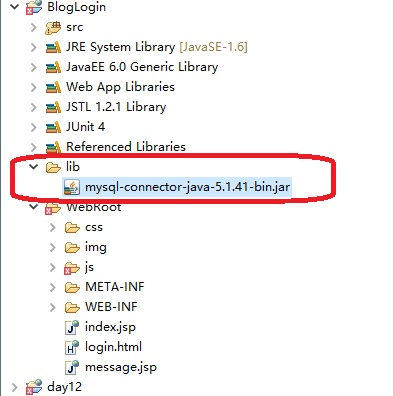

# JDBC的导入驱动的问题

# 问题

我新建了一个javaweb项目在myeclipse下,并且把Mysql的jdbc 驱动导入进去

如图:



然后开始链接数据库,进行单元测试,完美通过!

接下来,我就写了个web项目,部署在Tomacat服务器上,运行访问,点击登陆按钮

可怕的事情发生了,出错了,
```java
No suitable driver found
```
报了这个错,可是我明明已经导入了驱动喽,折腾了大半天,也没弄好,

然后就去谷歌搜了一下,发现原来还得在 WebRoot/WEB-INF/bin 目录下也要导入这个驱动.

唉,也难怪!!!,web项目本来就应该运行在Tomcat下,必须得有JDBC的实现啊,现在他自己他也没有实现,必须得导入啊.

然后再次测试才完美通过!
