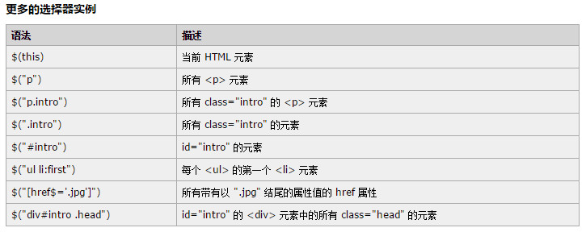
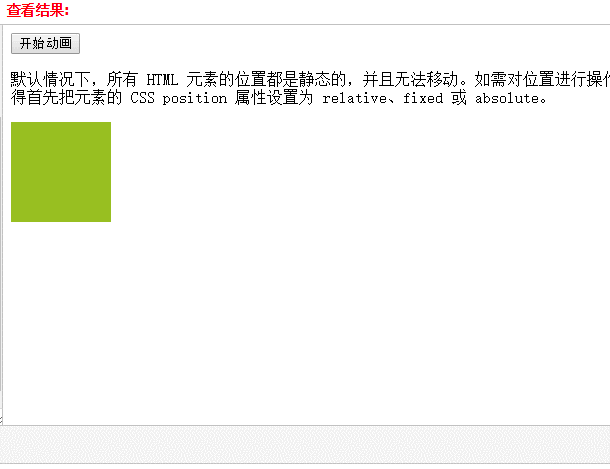

# JQuery速查手册
id---->>   #
class--->> .

# jQuery 语法

## jQuery 语法

jQuery 语法是为 HTML 元素的选取编制的，可以对元素执行某些操作。

基础语法是：$(selector).action()

        美元符号定义 jQuery

        选择符（selector）“查询”和“查找” HTML 元素

        jQuery 的 action() 执行对元素的操作

示例
```js
$(this).hide() - 隐藏当前元素
$("p").hide() - 隐藏所有段落
$(".test").hide() - 隐藏所有 class="test" 的所有元素
$("#test").hide() - 隐藏所有 id="test" 的元素
```
## 文档就绪函数
所有 jQuery 函数位于一个 document ready 函数中：
```js
$(document).ready(function(){

--- jQuery functions go here ----

});
```
**这是为了防止文档在完全加载（就绪）之前运行 jQuery 代码。
如果在文档没有完全加载之前就运行函数，操作可能失败.**

## jQuery 选择器
---


## jQuery 事件

**jQuery 是为事件处理特别设计的。**
```js
$("button").click(function() {..some code... } )
```
## html中引用外部js文件或css文件

如果您的网站包含许多页面，并且您希望您的 jQuery 函数易于维护，那么请把您的 jQuery 函数放到独立的 .js 文件中。
```js
<head>
<link rel="stylesheet" href="css/index.css"/>

<script type="text/javascript" src="jquery.js"></script>
<script type="text/javascript" src="my_jquery_functions.js"></script>
</head>

```

# Jquery 获取内容和属性
---
## 获得内容 - text()、html() 以及 val()

三个简单实用的用于 DOM 操作的 jQuery 方法：

* text() - 设置或返回所选元素的文本内容

* html() - 设置或返回所选元素的内容（包括 HTML 标记）

* val() - 设置或返回表单字段的值 

## 设置内容 - text()、html() 以及 val()

我们将使用前一章中的三个相同的方法来设置内容：

* text() - 设置或返回所选元素的文本内容

* html() - 设置或返回所选元素的内容（包括 HTML 标记）

* val() - 设置或返回表单字段的值

```js

$("#btn1").click(function(){
  $("#test1").text("Hello world!");
});
$("#btn2").click(function(){
  $("#test2").html("<b>Hello world!</b>");
});
$("#btn3").click(function(){
  $("#test3").val("Dolly Duck");
});
```

## 获取属性 - attr()
jQuery attr() 方法用于获取属性值。
```js
$("button").click(function(){
  alert($("#w3s").attr("href"));
});

```

## 设置属性 - attr()

jQuery attr() 方法也用于设置/改变属性值。
下面的例子演示如何改变（设置）链接中 href 属性的值：
```js

$("button").click(function(){
  $("#w3s").attr("href","http://www.w3school.com.cn/jquery");
});


$("button").click(function(){
  $("#w3s").attr({
    "href" : "http://www.w3school.com.cn/jquery",
    "title" : "W3School jQuery Tutorial"
  });
});
```

# jQuery - 添加元素

---
## 添加新的 HTML 内容

我们将学习用于添加新内容的四个 jQuery 方法：

* append() - 在被选元素的结尾插入内容
```js
$("p").append("Some appended text.");
```
* prepend() - 在被选元素的开头插入内容
 ```js
$("p").prepend("Some prepended text.");
 ```
 **上面两个添加是在备选元素的内部进行添加**
 **下面连个添加是在被选元素的外面进行添加**
* after() - 在被选元素之后插入内容
 
* before() - 在被选元素之前插入内容


**append() 和 prepend() 方法能够通过参数接收无限数量的新元素。可以通过 jQuery 来生成文本/HTML（就像上面的例子那样），或者通过 JavaScript 代码和 DOM 元素。**
```js
function appendText()
{
var txt1="<p>Text.</p>";               // 以 HTML 创建新元素
var txt2=$("<p></p>").text("Text.");   // 以 jQuery 创建新元素
var txt3=document.createElement("p");  // 以 DOM 创建新元素
txt3.innerHTML="Text.";
$("p").append(txt1,txt2,txt3);         // 追加新元素
}
```

# jQuery - 删除元素
---
## 通过 jQuery，可以很容易地删除已有的 HTML 元素。

如需删除元素和内容，一般可使用以下两个 jQuery 方法：

* remove() - 删除被选元素（及其子元素）
* empty() - 从被选元素中删除子元素

jQuery remove() 方法删除被选元素及其子元素。
```js

$("#div1").remove();
```

jQuery empty() 方法删除被选元素的子元素。
```js
$("#div1").empty()
```

下面的例子删除 class="italic" 的所有 ```<p>``` 元素：
```js
$("p").remove(".italic");
```

# jQuery - 获取并设置 CSS 类

---

## jQuery 操作 CSS

jQuery 拥有若干进行 CSS 操作的方法。我们将学习下面这些：

* addClass() - 向被选元素添加一个或多个类
* removeClass() - 从被选元素删除一个或多个类
* toggleClass() - 对被选元素进行添加/删除类的切换操作
css() - 设置或返回样式属性


```js
.important
{
font-weight:bold;
font-size:xx-large;
}

.blue
{
color:blue;
}
```

下面的例子展示如何向不同的元素添加 class 属性。当然，在添加类时，您也可以选取多个元素
```js
$("button").click(function(){
  $("h1,h2,p").addClass("blue");
  $("div").addClass("important");
});
```
也可以在 addClass() 方法中规定多个类：
```js
$("button").click(function(){
  $("#div1").addClass("important blue");
});

```
下面的例子将展示如何使用 jQuery toggleClass() 方法。该方法对被选元素进行添加/删除类的切换操作
```js
$("button").click(function(){
  $("h1,h2,p").toggleClass("blue");
});
```

# jQuery - css() 方法


设置 CSS 属性

面的例子将为所有匹配元素设置 background-color 值：
```js
$("p").css("background-color","yellow");
``
```js
$("p").css({"background-color":"yellow","font-size":"200%"});
```

# jQuery 效果 
---

## 隐藏和显示 jQuery hide() 和 show()
通过 jQuery，您可以使用 hide() 和 show() 方法来隐藏和显示 HTML 元素：
```js
$("#hide").click(function(){
  $("p").hide();
});

$("#show").click(function(){
  $("p").show();
});
```

可选的 speed 参数规定隐藏/显示的速度，可以取以下值："slow"、"fast" 或毫秒。
可选的 callback 参数是隐藏或显示完成后所执行的函数名称。
```js
$(selector).hide(speed,callback);

$(selector).show(speed,callback);
```

## jQuery toggle()切换隐藏和显示
通过 jQuery，您可以使用 toggle() 方法来切换 hide() 和 show() 方法。
```js
$("button").click(function(){
  $("p").toggle();
});
```

可选的 speed 参数规定隐藏/显示的速度，可以取以下值："slow"、"fast" 或毫秒。
可选的 callback 参数是 toggle() 方法完成后所执行的函数名称。
```js
$(selector).toggle(speed,callback);
```

##  淡入淡出 fadeIn() fadeOut() fadeToggle() fadeTo()

**jQuery fadeIn() 方法
jQuery fadeIn() 用于淡入已隐藏的元素。**

语法:
```js
$(selector).fadeIn(speed,callback);
```

实例
```js
$("button").click(function(){
  $("#div1").fadeIn();
  $("#div2").fadeIn("slow");
  $("#div3").fadeIn(3000);
});
```

**jQuery fadeOut() 方法
jQuery fadeOut() 方法用于淡出可见元素。**

语法：
```js
$(selector).fadeOut(speed,callback);
```
实例
```js
$("button").click(function(){
  $("#div1").fadeOut();
  $("#div2").fadeOut("slow");
  $("#div3").fadeOut(3000);
});
```
**jQuery fadeToggle() 方法**

jQuery fadeToggle() 方法可以在 fadeIn() 与 fadeOut() 方法之间进行切换。

如果元素已淡出，则 fadeToggle() 会向元素添加淡入效果。

如果元素已淡入，则 fadeToggle() 会向元素添加淡出效果。

语法：
```js
$(selector).fadeToggle(speed,callback);
```
实例
```js
$("button").click(function(){
  $("#div1").fadeToggle();
  $("#div2").fadeToggle("slow");
  $("#div3").fadeToggle(3000);
});
```

**jQuery fadeTo() 方法
jQuery fadeTo() 方法允许渐变为给定的不透明度（值介于 0 与 1 之间**

语法：

```js
$(selector).fadeTo(speed,opacity,callback);
```

        必需的 speed 参数规定效果的时长。它可以取以下值："slow"、"fast" 或毫秒。

        fadeTo() 方法中必需的 opacity 参数将淡入淡出效果设置为给定的不透明度（值介于 0 与 1 之间）。

        可选的 callback 参数是该函数完成后所执行的函数名称。

实例
```js
$("button").click(function(){
  $("#div1").fadeTo("slow",0.15);
  $("#div2").fadeTo("slow",0.4);
  $("#div3").fadeTo("slow",0.7);
});
```

## 滑动 slideDown() slideUp() slideToggle()


**jQuery slideDown() 方法
jQuery slideDown() 方法用于向下滑动元素。**

语法：
```js
$(selector).slideDown(speed,callback);
```
实例
```js
$("#flip").click(function(){
  $("#panel").slideDown();
});
```
**注意设置某个空间滑动显示时,把那个空间设置style属性为   display:none;**

**jQuery slideUp() 方法,jQuery slideUp() 方法用于向上滑动元素。**

**jQuery slideToggle() 方法**

    jQuery slideToggle() 方法可以在 slideDown() 与 slideUp() 方法之间进行切换。

    如果元素向下滑动，则 slideToggle() 可向上滑动它们。

    如果元素向上滑动，则 slideToggle() 可向下滑动它们。

```js
$(selector).slideToggle(speed,callback);
```
效果


**动画**

> 默认情况下，所有 HTML 元素的位置都是静态的，并且无法移动。如需对位置进行操作，记得首先把元素的 CSS position 属性设置为 relative、fixed 或 absolute。
jQuery 动画 - animate() 方法

jQuery animate() 方法用于创建自定义动画。

语法：
```js
$(selector).animate({params},speed,callback);
```

    必需的 params 参数定义形成动画的 CSS 属性。

    可选的 speed 参数规定效果的时长。它可以取以下值："slow"、"fast" 或毫秒。

    可选的 callback 参数是动画完成后所执行的函数名称。

实例
```js
$("button").click(function(){
  $("div").animate({left:'250px'});
}); 
```
left参数: 从左边开始移动250px

实例
```js
$(document).ready(function(){
  $("button").click(function(){
    $("div").animate({
      left:'250px',
      opacity:'0.5',//opacity 透明性
      height:'150px', //高度变为150px
      width:'150px' //宽度变为150px
    });
  });
});
```
效果:




#jQuery - Chaining 链接

## 通过 jQuery，您可以把动作/方法链接起来

jQuery 方法链接

直到现在，我们都是一次写一条 jQuery 语句（一条接着另一条）。

不过，有一种名为链接（chaining）的技术，允许我们在相同的元素上运行多条 jQuery 
命令，一条接着另一条。

提示：这样的话，浏览器就不必多次查找相同的元素。

如需链接一个动作，您只需简单地把该动作追加到之前的动作上。

下面的例子把 css(), slideUp(), and slideDown() 链接在一起。"p1" 元素首先会变为红色，然后向上滑动，然后向下滑动：
```js
$("#p1").css("color","red").slideUp(2000).slideDown(2000);
```
这样写也可以运行：
```js
$("#p1").css("color","red")
  .slideUp(2000)
  .slideDown(2000);
```

# jQuery - AJAX 简介

> AJAX 是与服务器交换数据的艺术，它在不重载全部页面的情况下，实现了对部分网页的更新。
> 

## 关于 jQuery 与 AJAX

    jQuery 提供多个与 AJAX 有关的方法。

    通过 jQuery AJAX 方法，您能够使用 HTTP Get 和 HTTP Post 从远程服务器上请求文本、HTML、XML 或 JSON - 同时您能够把这些外部数据直接载入网页的被选元素中。

    提示：如果没有 jQuery，AJAX 编程还是有些难度的。
    编写常规的 AJAX 代码并不容易，因为不同的浏览器对 AJAX 的实现并不相同。这意味着您必须编写额外的代码对浏览器进行测试。不过，jQuery 团队为我们解决了这个难题，我们只需要一行简单的代码，就可以实现 AJAX 功能。

## [jQuery - AJAX load() 方法](http://www.w3school.com.cn/jquery/jquery_ajax_load.asp)

    jQuery load() 方法
    jQuery load() 方法是简单但强大的 AJAX 方法。
    load() 方法从服务器加载数据，并把返回的数据放入被选元素中。

语法：
```js
$(selector).load(URL,data,callback);
```
必需的 URL 参数规定您希望加载的 URL。

可选的 data 参数规定与请求一同发送的查询字符串键/值对集合。

可选的 callback 参数是 load() 方法完成后所执行的函数名称。


下面的例子会在 load() 方法完成后显示一个提示框。如果 load() 方法已成功，则显示“外部内容加载成功！”，而如果失败，则显示错误消息
```js
$("button").click(function(){
  $("#div1").load("demo_test.txt",function(responseTxt,statusTxt,xhr){
    if(statusTxt=="success")
      alert("外部内容加载成功！");
    if(statusTxt=="error")
      alert("Error: "+xhr.status+": "+xhr.statusText);
  });
});
```
可选的 callback 参数规定当 load() 
方法完成后所要允许的回调函数。回调函数可以设置不同的参数：

responseTxt - 包含调用成功时的结果内容
statusTXT - 包含调用的状态
xhr - 包含 XMLHttpRequest 对象

# jQuery - AJAX get() 和 post() 方法

> jQuery get() 和 post() 方法用于通过 HTTP GET 或 POST 请求从服务器请求数据。

**HTTP 请求：GET vs. POST**

两种在客户端和服务器端进行请求-响应的常用方法是：GET 和 POST。

GET - 从指定的资源请求数据

POST - 向指定的资源提交要处理的数据

GET 基本上用于从服务器获得（取回）数据。注释：GET 方法可能返回缓存数据。

POST 也可用于从服务器获取数据。不过，POST 方法不会缓存数据，并且常用于连同请求一起发送数据。


### jQuery $.get() 方法

> $.get() 方法通过 HTTP GET 请求从服务器上请求数据。

语法：
```js
$.get(URL,callback);
```
    必需的 URL 参数规定您希望请求的 URL。
    可选的 callback 参数是请求成功后所执行的函数名。
    下面的例子使用 $.get() 方法从服务器上的一个文件中取回数据：

实例
```js
$("button").click(function(){
  $.get("demo_test.asp",function(data,status){
    alert("Data: " + data + "\nStatus: " + status);
  });
});
```
$.get() 的第一个参数是我们希望请求的 URL（"demo_test.asp"）。
第二个参数是回调函数。

第一个回调参数存有被请求页面的内容，

第二个回调参数存有请求的状态.(status为success或者error)

### jQuery $.post() 方法
> $.post() 方法通过 HTTP POST 请求从服务器上请求数据。

语法：
```js
$.post(URL,data,callback);
```

    必需的 URL 参数规定您希望请求的 URL。

    可选的 data 参数规定连同请求发送的数据。

    可选的 callback 参数是请求成功后所执行的函数名。

    下面的例子使用 $.post() 连同请求一起发送数据：


实例
```js
$("button").click(function(){
  $.post("demo_test_post.asp",
  {
    name:"Donald Duck",
    city:"Duckburg"
  },
  function(data,status){
    alert("Data: " + data + "\nStatus: " + status);
  });
});
```

    $.post() 的第一个参数是我们希望请求的 URL ("demo_test_post.asp")。

    然后我们连同请求（name 和 city）一起发送数据。

    "demo_test_post.asp" 中的 ASP 脚本读取这些参数，对它们进行处理，然后返回结果。

    第三个参数是回调函数。第一个回调参数存有被请求页面的内容，而第二个参数存有请求
    的状态。


# [$.ajax() 方法的使用](http://www.jb51.net/article/65064.htm)

jQuery.ajax( options ) : 通过 HTTP 请求加载远程数据，这个是jQuery 的底层 AJAX 实现。简单易用的高层实现见 $.get, $.post 等。


