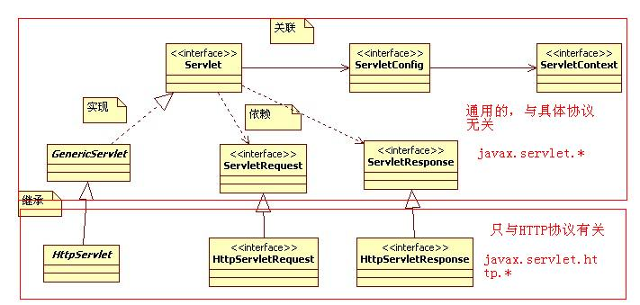

# Servlet

Servlet规范核心类图.jpg




## servlet执行过程
```xml
1.客户端发出请求http://localhost:8080/Demo1/abc.

2.根据web.xml文件的配置，找到<url-pattern>子元素的值“/hello”的<servlet-mapping>元素

读取<servlet-mapping>元素的<servlet-name>子元素的值，由此确定Servlet的名字为”HelloServlet”

3.找到<servlet-name>值为HelloServlet的<servlet>元素
读取<servlet>元素的<servlet-class>子元素的值，由此确定Servlet的类名为cn.itcast.HelloServlet。

4.到Tomcat安装目录/webapps/Demo1/WEB-INF/classes/cn/itcast目录下查找到HelloServlet.class文件
```

## servlet 的一些细节
```xml
    1.由于客户端是通过URL地址访问web服务器中的资源，所以Servlet程序若想被外界访问，必须把servlet程序映射到一个URL地址上，这个工作在web.xml文件中使用<servlet>元素和<servlet-mapping>元素完成。

       2. <servlet>元素用于注册Servlet，它包含有两个主要的子元素：<servlet-name>和<servlet-class>，分别用于设置Servlet的注册名称和Servlet的完整类名。 
        一个<servlet-mapping>

       3. 元素用于映射一个已注册的Servlet的一个对外访问路径，它包含有两个子元素：<servlet-name>和<url-pattern>，分别用于指定Servlet的注册名称和Servlet的对外访问路径。例如：
```

```xml
<web-app>
    <servlet>
        <servlet-name>AnyName</servlet-name>
        <servlet-class>HelloServlet</servlet-class>
    </servlet>
    <servlet-mapping>
        <servlet-name>AnyName</servlet-name>
        <url-pattern>/demo/hello.html</url-pattern>
    </servlet-mapping>
</web-app>

```

```xml
    如果某个Servlet的映射路径仅仅为一个正斜杠（/），那么这个Servlet就成为当前Web应用程序的缺省Servlet。 

    凡是在web.xml文件中找不到匹配的<servlet-mapping>元素的URL，它们的访问请求都将交给缺省Servlet处理，也就是说，缺省Servlet用于处理所有其他Servlet都不处理的访问请求。

    在<tomcat的安装目录>\conf\web.xml文件中，注册了一个名称为org.apache.catalina.servlets.

    DefaultServlet的Servlet，并将这个Servlet设置为了缺省Servlet。
    当访问Tomcat服务器中的某个静态HTML文件和图片时，实际上是在访问这个缺省Servlet。 
```

### 默认初始化 servlet

如果在<servlet>元素中配置了一个<load-on-startup>元素，那么WEB应用程序在启动时，就会装载并创建Servlet的实例对象、以及调用Servlet实例对象的init()方法。

    举例：
```xml
    <servlet>
        <servlet-name>invoker</servlet-name>
        <servlet-class>
            org.apache.catalina.servlets.InvokerServlet
        </servlet-class>
        <load-on-startup>2</load-on-startup>
    </servlet>
```

用途：为web应用写一个InitServlet，这个servlet配置为启动时装载，为整个web应用创建必要的数据库表和数据。


## ServletContext 对象
```java
    WEB容器在启动时，它会为每个WEB应用程序都创建一个对应的ServletContext对象，它代表当前web应用。

    ServletConfig对象中维护了ServletContext对象的引用，开发人员在编写servlet时，可以通过ServletConfig.getServletContext方法获得ServletContext对象。

    由于一个WEB应用中的所有Servlet共享同一个ServletContext对象，因此Servlet对象之间可以通过ServletContext对象来实现通讯。ServletContext对象通常也被称之为context域对象。
```

## ServletContext应用
```java
1.多个Servlet通过ServletContext对象实现数据共享。

ServletContext对象是一个域对象（域对象就是说其内部维护了一个Map<String,Object>）

                Object getAttribute(String name):根据名称获取绑定的对象
                Enumeration getAttributeNames() :获取ServletContext域中的所有名称
                void removeAttribute(String name):根据名称移除对象
                void setAttribute(String name,Object value):添加或修改对象


2.获取WEB应用的初始化参数。

在web.xml的根元素下配置一下信息：
            <context-param>
                <param-name>encoding</param-name>
                <param-value>UTF-8</param-value>
            </context-param>
            这些参数就属于整个应用的全局参数，使用ServletContext来读取。
读取资源文件的三种方式：
            利用ServletContext.getRealPath():
                    特点：读取应用中任何文件。只能在Web环境下用
            利用ResourceBundle读取配置文件
                    特点：可以用在非web环境下。但是只能读取类路径中的properties文件
            利用类加载器读取配置文件（专业）
                    特点：可以用在非web环境下。可以读取类路径下的任何文件。
3.实现Servlet的转发。

4.利用ServletContext对象读取资源文件。
.properties文件（属性文件）

 得到文件路径(ServletContext.getRealPath(),ServletContext.getReaourceAsStream())
```

## servlet路径问题

下载文件实例:

```java
    //最简单的文件下载
    private void test1(HttpServletResponse response)
            throws FileNotFoundException, IOException {
        //得到要下载的文件
        ServletContext sc = getServletContext();
        String path = sc.getRealPath("/f.jpg");
        //得到文件的真实路径。路径必须以"/"开头，"/"就代表者当前应用即相对于Tomcat的目录
        System.out.println(path);
        //构建输入流
        InputStream in = new FileInputStream(path);
        //通知客户端以下载的方式打开
        response.setHeader("Content-Disposition", "attachment;filename=f.jpg");
        response.setHeader("Content-Type", "application/octet-stream");
        //response.getOutputStream()得到输出流
        OutputStream out = response.getOutputStream();
        int len = -1;
        byte b[] = new byte[1024];
        while((len=in.read(b))!=-1){
            out.write(b, 0, len);
        }
        in.close();
        out.close();
    }


//中文文件下载
    private void test2(HttpServletResponse response)
            throws FileNotFoundException, IOException {
        //得到要下载的文件
        ServletContext sc = getServletContext();
        String path = sc.getRealPath("/美女.jpg");//得到文件的真实路径。路径必须以"/"开头，"/"就代表者当前应用
        //截取文件名  C:\apache-tomcat-6.0.35\webapps\day06\美女.jpg
        String filename = path.substring(path.lastIndexOf("\\")+1);
        System.out.println(filename);
        //构建输入流
        InputStream in = new FileInputStream(path);
        //通知客户端以下载的方式打开
        response.setHeader("Content-Disposition", "attachment;filename="+URLEncoder.encode(filename,"UTF-8"));//中文文件名此处要进行URL编码
        response.setHeader("Content-Type", "application/octet-stream");
        //response.getOutputStream()得到输出流
        OutputStream out = response.getOutputStream();
        int len = -1;
        byte b[] = new byte[1024];
        while((len=in.read(b))!=-1){
            out.write(b, 0, len);
        }
        in.close();
        out.close();
    }

```


## 数据输出
**输出中文数据**
###字节流：
            out.write("中文".getBytes("UTF-8"));有乱码
            解决办法：
                方式一：更改浏览器的查看编码（不可取）
                
                通知浏览器，使用的码表
                方式二：response.setHeader("Content-Type", "text/html;charset=UTF-8");
                方式三：response.getOutputStream().write("<meta http-equiv='Content-Type' content='text/html;charset=UTF-8'>".getBytes("UTF-8"));
                *方式四：response.setContentType("text/html;charset=UTF-8");//方式二、三、四都是一样的
   

###字符流：
            Servlet中的字符流默认查ISO-8859-1（SUN的Servlet规范要求的）
            如何更改这个默认的编码呢？response.setCharacterEncoding("UTF-8");
            
            //不要忘记通知浏览器的编码
            response.setCharacterEncoding("UTF-8");
            response.setHeader("Content-Type", "text/html;charset=UTF-8");
            PrintWriter out = response.getWriter();
            out.write(s);//默认查的是ISO-8859-1码表（SUN的Servlet规范要求的）
            
            
            在字符流输出中文数据时：response.setContentType("text/html;charset=UTF-8");
                    有两个作用：通知字符流以UTF-8编码输出
                                通知客户端以UTF-8解码显示

## response输出相应头

刷新
```java

private void test2(HttpServletResponse response) throws IOException {
        response.setContentType("text/html;charset=UTF-8");
        PrintWriter out = response.getWriter();
        response.setHeader("Refresh", "2;URL=/day06/index.html");
        out.write("登录成功！2秒后将跳转到主页！若没有跳转，请猛点<a href='/day06/index.html'>这里</a>");
    }
    //定时刷新到自己
    private void test1(HttpServletResponse response) throws IOException {
        Random r = new Random();
        int i = r.nextInt();
//      response.setHeader("Refresh", "1");
        response.setIntHeader("Refresh", 1);
        response.getOutputStream().write((i+"").getBytes());
    }
```
## 配置web项目下的默认主页.

可以直接访问项目名跳转到该url
```xml
  <welcome-file-list>
<!--<welcome-file>servlet/ResponseDemo5</welcome-file>-->
    <welcome-file>default.html</welcome-file>
  </welcome-file-list>
```


## response 请求重定向

通过response实现请求重定向。

请求重定向指：一个web资源收到客户端请求后，通知客户端去访问另外一个web资源，这

称之为请求重定向。

地址栏会变，并发送2次请求，增加服务器负担

实现方式

response.sendRedirect()

实现原理：

302/307状态码和location头即可实现重定向

```java
//请求重定向
public class ResponseDemo7 extends HttpServlet {
    public void doGet(HttpServletRequest request, HttpServletResponse response)
            throws ServletException, IOException {
//      response.setStatus(302);
//      response.setHeader("Location", "/day06/login.html");
        response.sendRedirect("/day06/login.html");//作用同上
    }
    public void doPost(HttpServletRequest request, HttpServletResponse response)
            throws ServletException, IOException {
        doGet(request, response);
    }

}
```

##response细节

getOutputStream和getWriter方法分别用于得到输出二进制数据、输出文本数据的ServletOuputStream、Printwriter对象。

getOutputStream和getWriter这两
个方法互相排斥，调用了其中的任何一个方法后，就不能再调用另一方法。  会抛异常。

Servlet程序向ServletOutputStream或PrintWriter对象中写入的数据将被Servlet引擎从response里面获取，Servlet引擎将这些数据当作响应消息的正文，然后再与响应状态行和各响应头组合后输出到客户端。

Serlvet的service方法结束后，Servlet引擎将检查getWriter或getOutputStream方法返回的输出流对象是否已经调用过close方法，如果没有，Servlet引擎将调用close方法关闭该输出流对象


## HttpServletRequest

###请求转发和重定向

        请求转发借助于RequestDispatcher
        如何得到RequestDispatcher对象：
            方式一：ServletContext.getRequestDispatcher(目标资源的URI);
            方式二：ServletRequest.getRequestDispatcher(目标资源的URI);
            区别：
                方式一中的目标资源的URI必须以"/"开头，否则报错，此"/"就表示的是当前应用（绝对路径表示法）
                方式二中的目标资源的URI如果以"/"开头，就表示的是当前应用（绝对路径表示法）。如果不以"/"开头，就表示相对路径。
                


##各种URL地址的写法

        相对路径
        绝对路径：（建议的）
        绝对路径怎么写？什么时候需要加上应用名称"/day07"?
        原则：地址是不是给服务器用的，如果是,"/"就代表着当前应用。如果是给客户端用的绝对路径要加上应用名称。
        
        
        <link href=path/>                                要加/day07
        <script src=path/>                              要加/day07
                                         要加/day07
        <a href=path/>                                  要加/day07
        RequestDispatcher.include(path)                 不要加，"/"就代表着当前应用
        RequestDispatcher.forward(path)                 不要加，"/"就代表着当前应用
        HttpServletResponse.sendRedirect(path)          要加/day07
        ServletContext.getRealPath(path)                不要加，"/"就代表着当前应用


