# 使用GIT上传项目到github

---

> 本篇文章只介绍windows下,git的简单使用(上传代码到github),作为一门对git不熟的入门教程,不涉及git原理,只是让大家了解到git的强大,为后续学习git做铺垫.

## 准备
*  1. 注册github账号
*  2.下载 Git(windows)
*  3.下载 TortoiseGit(windows)

## 安装Git和TortoiseGit

    安装时一切默认即可,但有一点要注意,要先安装Git再安装TortoiseGit

    安装完毕,在桌面上点击右键,会看到多出一些菜单出来,表示你已经安装成功.

## 测试安装成功

* 1. 在windows桌面上新建一个文件夹,命名为 GitTest,然后在该文件夹下新建一个txt文件,如下图

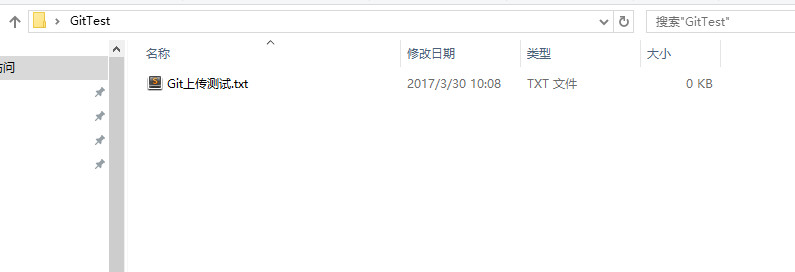

* 2. 接下来我们在 GitTest文件夹上右键--TortoiseGit--setting,然后在点击git,进行如下配置

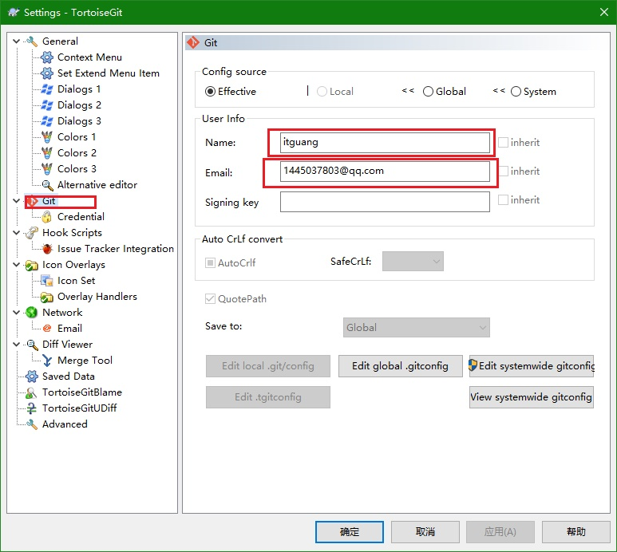

    其中 Name 为,你的github账号名称
    Email为你注册github时的邮箱,点击确定即可

* 3.然后我们在 GitTest文件夹上,右键---Git Create responistory here...,会出现一个对话框,点击ok即可,会在弹出一个对话框,点击确定.

上面步骤做完后,文件夹会变成这个样子

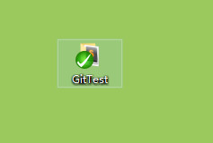

* 4,下面我们先提交项目到本地的git,在GitTest文件夹上右键---Git Commit ->"master"

   会出现如下对话框

   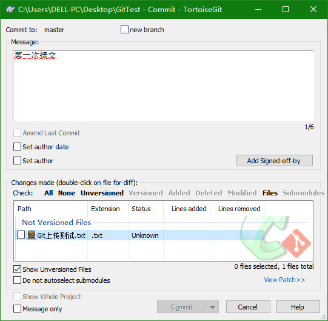

   在Message里面填写,提交日志,然后在下面,我们会看到我们新建的txt文件,它的状态为Unknown,我们在它上面点击,右键---Add---确定即可

   如下图

   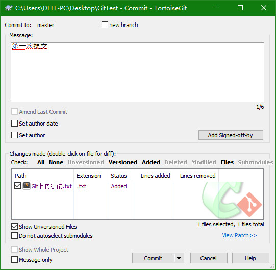

   点击 Commit,到此,我们已经提交代码到我们本地仓库了,那么如何提交代码到我们的github远程仓库呢???

* 5.接下来,提交代码到我们的github远程仓库,继续在GitTest文件夹下右键---TortoiseGit----push

会出现如下对话框,

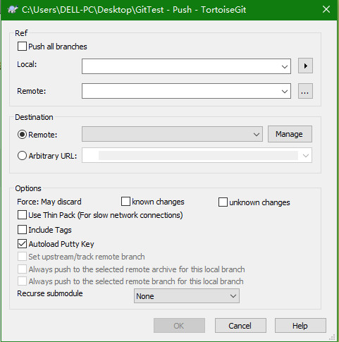

我们点击manage,进入下一个对话框,
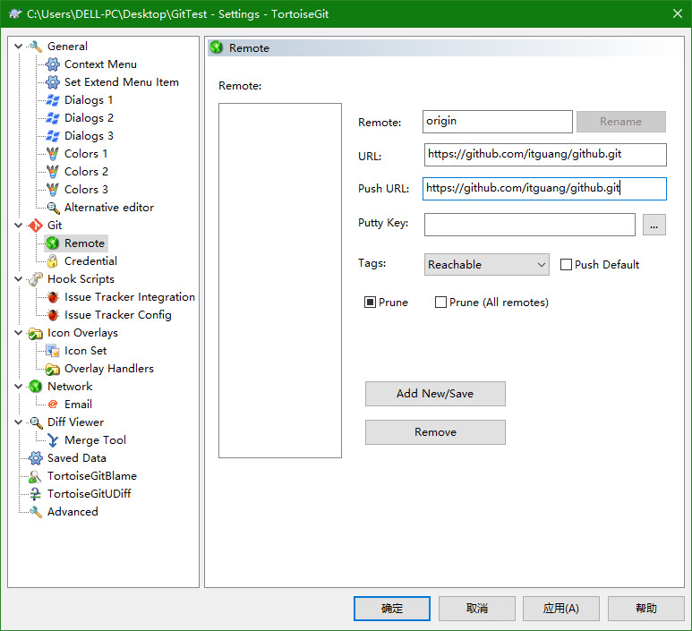

  在URL和Push URL输入框中,粘贴我们在github上创建的仓库地址,注意是 https 开头的那个

  如下图:

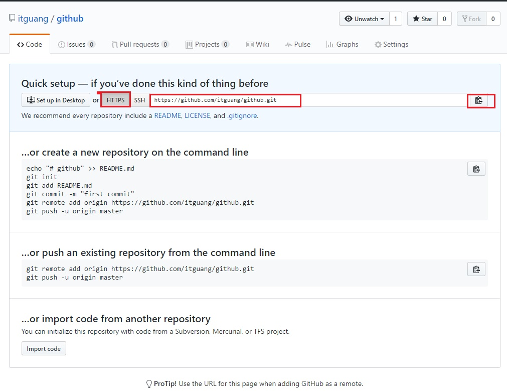

点击确定,会出现下图所示

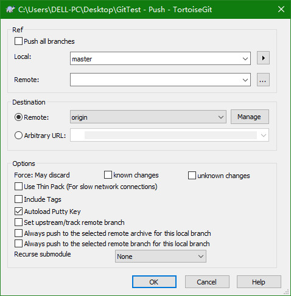

点击ok,会让我们输入github用户名和密码

如下

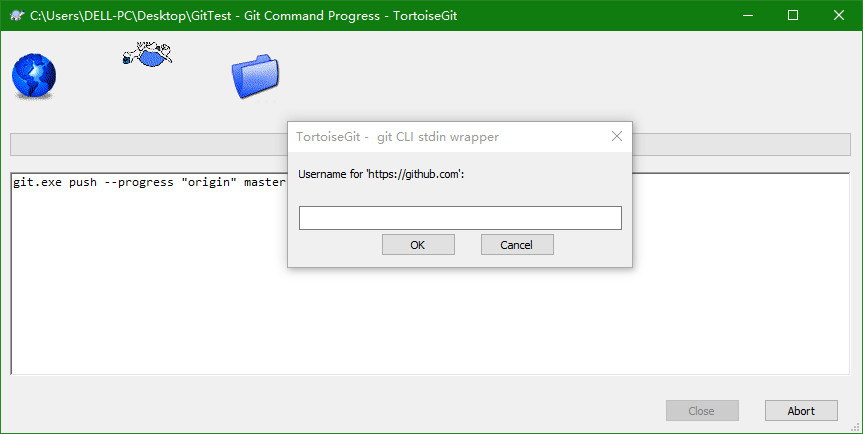

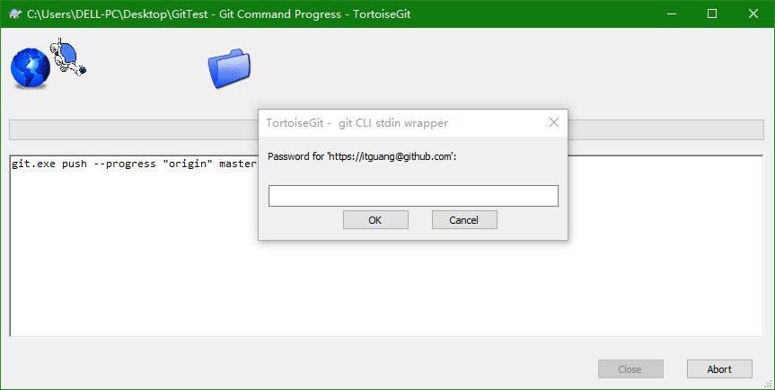

输入我们在github注册的用户名和密码后,如果显示如下图,则提交成功

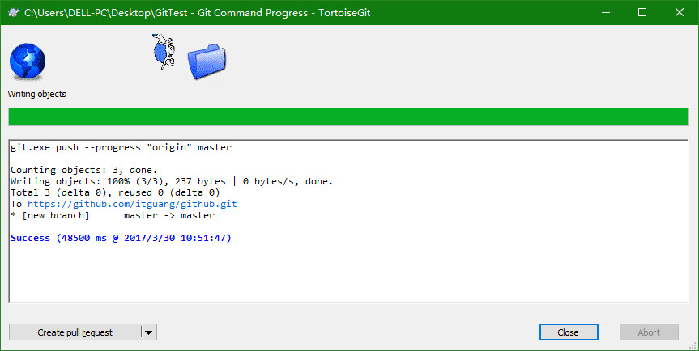

* 6. 上面的步骤做完就大功告成了,我们可以去我们的github上新建的那个仓库页面点击刷新,就会看到我们刚才提交的项目

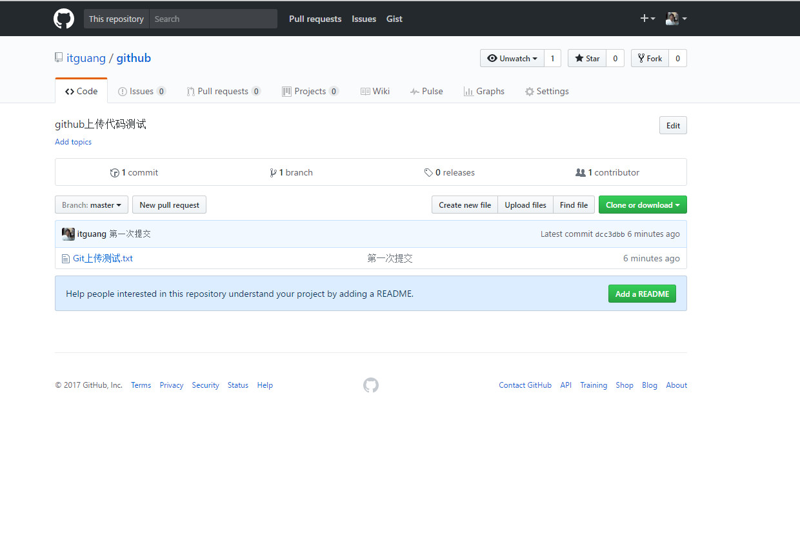

