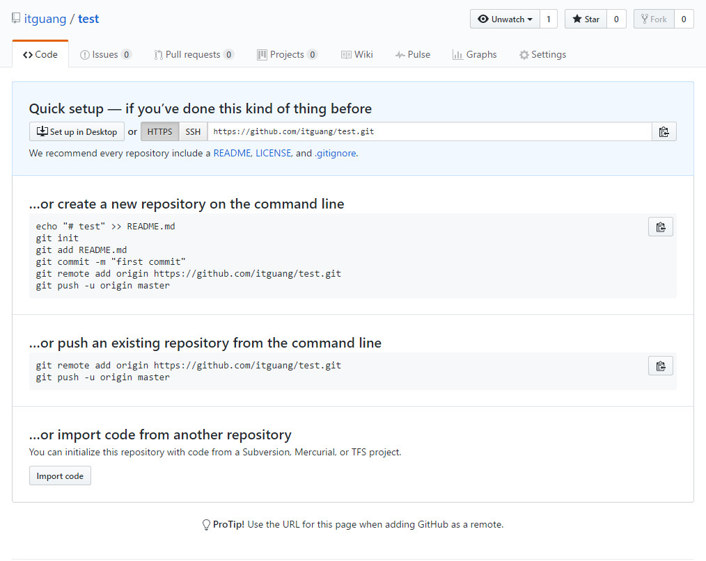

# 添加为远程仓库

## 问题描述:
> 我们在自己的电脑上见了一个项目,比如javaweb项目,当项目比较复杂,便想把它托管到github上,那怎么做呢,别着急本篇文章就是叫你怎样这样做的!!!
> 


## 准备

> 1.安装git
> 2.有一个github账号

如果准备工作做完了,那就开始下面的工作吧

下面我会介绍两种方式:命令行方式和图形界面方式(需要安装TortoiseGit)
## 命令行方式 (windows环境下)

首先在你的github上面新建一个仓库,注意不要创建 README.md 文件,然后复制该仓库的https地址

如图



接下来在你想要托管的项目上右键---Git Bash Here

进入命令行模式,输入

        git init    //通过git init命令把这个目录变成Git可以管理的仓库

        git add .   //把该目录下的所有文件添加的暂存区

        git commit   //把暂存区的文件提交到本地仓库

接下来要把本地仓库关联到我们的远程仓库
```git
git remote add origin https://github.com/itguang/test.git   //关联一个远程库

```
关联后,我们使用下面命令,把本地仓库push到远程仓库

    git push -u origin master    //使用命令git push -u origin master第一次推送master分支的所有内容

此后，每次本地提交后，只要有必要，就可以使用命令
```git
git push origin master
```
推送最新修改.

**到此,我们就做完了,接下来就验证一下是否成功,在我们新建的github仓库页面刷新,看看,我们刚才的项目是不是出现在里面了**

别先急着高兴,还记得我为什么要你新建仓库的时候不要初始化readme.md文件吗?

接下来我们就做个实验

在github仓库上创建一个README.md文件,随便写个什么都行,然后保存.

然后在我们本地刚才那个仓库也就是那个文件下新建一个hello.txt的文件,

按照下面的步骤

    git add hello.txt

    git commit

    git push origin master

就会出现如下错误提示

```git
To https://github.com/itguang/test.git
 ! [rejected]        master -> master (fetch first)
error: failed to push some refs to 'https://github.com/itguang/test.git'
hint: Updates were rejected because the remote contains work that you do
hint: not have locally. This is usually caused by another repository pushing
hint: to the same ref. You may want to first integrate the remote changes
hint: (e.g., 'git pull ...') before pushing again.
hint: See the 'Note about fast-forwards' in 'git push --help' for details.


```
这叫做分支冲突,因为本地仓库和远程仓库都又各自增加了一个文件,当再次提交本地仓库到远程仓库时,就会出现冲突,无法合并

解决办法

先执行

    git pull origin master //把远程仓库pull到本地仓库

然后在push

    git push origin master

此时就不会冲突了


## 使用TortoiseGit提交

由于我之前已经写过一篇文章,就不重复介绍了,有需要的请移步

[使用GIT上传项目到github](https://github.com/itguang/github/blob/master/git%E4%B8%8A%E4%BC%A0%E9%A1%B9%E7%9B%AE%E5%88%B0github.md)


