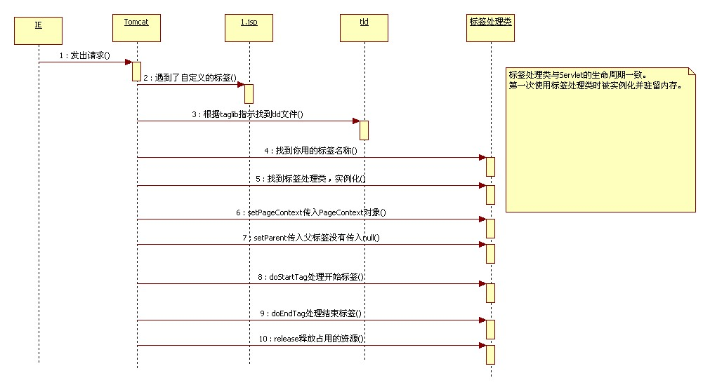
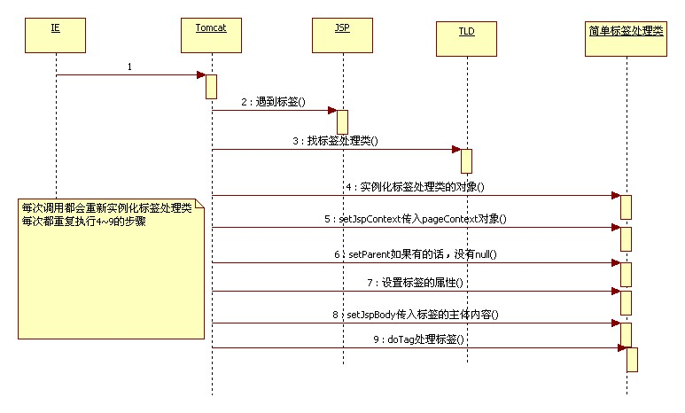

# 自定义标签开发

1、自定义标签属于JSP技术中的

##一、标签的作用
    移除掉JSP中的Java脚本(<%%>)

## 自定义标签步骤:

1、编写一个类，直接或间接实现javax.servlet.jsp.tagext.Tag接口
```java
        package cn.itcast.tag;

        import java.io.IOException;
        import javax.servlet.jsp.JspException;
        import javax.servlet.jsp.tagext.TagSupport;
        //TagSupport实现了Tag接口
        public class ShowRemoteIpTag extends TagSupport {
            public int doStartTag() throws JspException {
                String remoteIp = pageContext.getRequest().getRemoteAddr();
                try {
                    pageContext.getOut().write(remoteIp);
                } catch (IOException e) {
                    e.printStackTrace();
                }
                return super.doStartTag();
            }
        }
```
```xml
    2、在WEB-INF目录下建立一个扩展名为tld（Tag Libary Definition）的xml文件。
    <?xml version="1.0" encoding="UTF-8"?>
    <taglib xmlns="http://java.sun.com/xml/ns/j2ee"
        xmlns:xsi="http://www.w3.org/2001/XMLSchema-instance"
        xsi:schemaLocation="http://java.sun.com/xml/ns/j2ee http://java.sun.com/xml/ns/j2ee/web-jsptaglibrary_2_0.xsd"
        version="2.0">
        <tlib-version>1.0</tlib-version>
        <short-name>itcast</short-name>
        <uri>http://www.itcast.cn/jsp/jstl</uri>
        <tag><!-- 描述标签 -->
            <description>Show Remote Address</description>
            <name>showRemoteIp</name>
            <tag-class>cn.itcast.tag.ShowRemoteIpTag</tag-class>
            <body-content>empty</body-content><!-- 指示标签的主体内容：没有就写empty -->
        </tag>
    </taglib>
    ```
    3、（可选的）在web.xml中对tld文件和名称空间进行映射对应。
      <jsp-config>
        <taglib>
            <taglib-uri>http://www.itcast.cn/jsp/jstl</taglib-uri>
            <taglib-location>/WEB-INF/itcast.tld</taglib-location>
        </taglib>
      </jsp-config>

    4、在JSP中使用
```xml

        <%@ taglib uri="http://www.itcast.cn/jsp/jstl" prefix="itcast"%>
```

## 三、标签执行步骤和原理
### 标签的执行步骤和原理


### 简单标签的执行过程和原理

